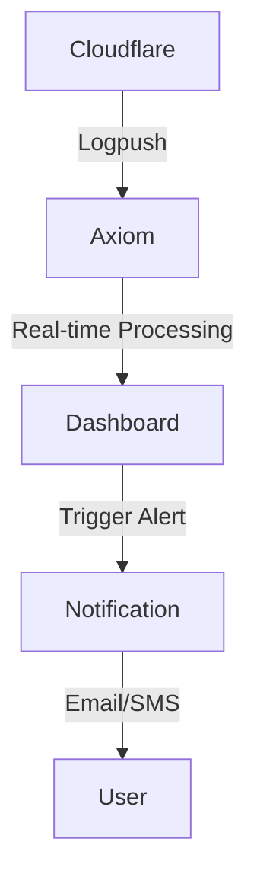
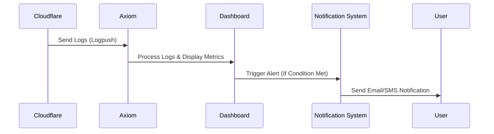

# Axiom-Cloudflare Dashboard, Alerting & Notification Solution

## Overview

This project integrates Cloudflare logs with **Axiom** to provide real-time monitoring, alerting, and notifications. The setup replaces traditional **Grafana/Loki/Prometheus**, offering a **simpler** and **more efficient** approach for log management.

### **Key Features**

- Real-time Cloudflare log monitoring
- Alerting based on predefined conditions
- Notification integration for immediate response
- **Official Cloudflare-Axiom integration**

## **Cloudflare Logpush Limitations**

Cloudflare's **Logpush** service has **limits** based on account plans:

- Some logs (e.g., Zero Trust Network sessions) exceed free-tier limits.
- Logs may need to be **filtered** using **APL** or **SQL**.

## **Supported Cloudflare Logs**

| **Scope**          | **Log Type**                                                                                                                                                                     |
| ------------------ | -------------------------------------------------------------------------------------------------------------------------------------------------------------------------------- |
| **Zone-Scoped**    | DNS logs, Firewall events, HTTP requests, NEL reports, Spectrum events                                                                                                           |
| **Account-Scoped** | Access requests, Audit logs, CASB Findings, Device posture results, DNS Firewall Logs, Gateway logs, Magic IDS Detections, Workers Trace Events, Zero Trust Network Session Logs |

## **Setup Guide**

### **1. Axiom Dashboard Setup**

1. Register and log in to **[Axiom](https://axiom.co/)**.
2. Navigate to `Settings -> Apps -> Install Now (Cloudflare Logpush)`.
3. Insert your **Cloudflare API Token**.
4. Ensure **Logpush is enabled** at both:
   - **Zone Level**
   - **Account Level**

### **2. Real-time Monitoring & Alerting**

- **Dashboard:** [Real-time Cloudflare Dashboard](https://app.axiom.co/twister5-i1b4/dashboards/cloudflare-logpush?v_%40cloudflare_AccountName_filter=%2A&v_%40cloudflare_ZoneName_filter=%2A)
- **Alert Condition:** If WAF triggers **>500 times in 10 minutes**, send an **alert**.

## **Data Flow Diagram**

## **Alerting & Notification Workflow**

## **Notification Methods**

- **Email**
- **SMS**
- **Webhook Integrations**

## **GitHub & UI Templates**

- Axiom GitHub: [axiomhq/axiom-js](https://github.com/axiomhq)
- UI Templates: [Next.js branch](https://github.com/axiomhq/axiom-js/tree/next13)

## **Cloudflare API Token Permissions**

Ensure that the **API token** used has **sufficient permissions** to:

- Read log data
- Push logs to Axiom

## **Additional Resources**

- Cloudflare Official Docs: [Cloudflare Logpush](https://developers.cloudflare.com/logpush/)
- Axiom Official Site: [Axiom](https://axiom.co/)

---

**dennis.lee@twister5 | 極風雲創**
