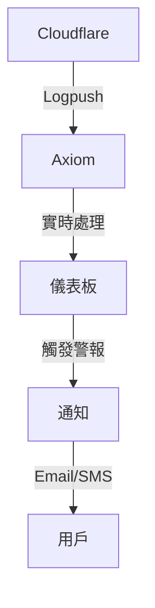
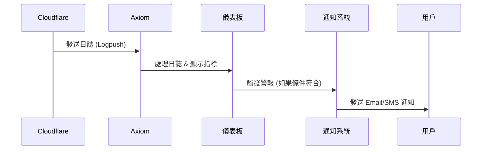

# Axiom-Cloudflare 儀表板、警報與通知解決方案

## 概述

這個專案將 Cloudflare 記錄與 **Axiom** 整合，以提供實時監控、警報和通知。此設置取代了傳統的 **Grafana/Loki/Prometheus**，提供了一種 **更簡單** 和 **更有效** 的日誌管理方法。

### **主要功能**

- 實時 Cloudflare 記錄監控
- 基於預定義條件的警報
- 通知整合，以便立即響應
- **官方 Cloudflare-Axiom 整合**

## **Cloudflare Logpush 限制**

Cloudflare 的 **Logpush** 服務基於帳戶方案有 **限制**：

- 某些日誌（例如，Zero Trust 網路會話）超出了免費套餐的限制。
- 日誌可能需要使用 **APL** 或 **SQL** 進行 **過濾**。

## **支援的 Cloudflare 記錄**

| **範圍**     | **日誌類型**                                                                                                                     |
| ------------ | -------------------------------------------------------------------------------------------------------------------------------- |
| **區域範圍** | DNS 記錄、防火牆事件、HTTP 請求、NEL 報告、Spectrum 事件                                                                         |
| **帳戶範圍** | 訪問請求、審計日誌、CASB 發現、設備狀態結果、DNS 防火牆日誌、網關日誌、Magic IDS 檢測、Workers 追蹤事件、Zero Trust 網路會話日誌 |

## **設置指南**

### **1. Axiom 儀表板設置**

1.  註冊並登錄到 **[Axiom](https://axiom.co/)**。
2.  導航到 `Settings -> Apps -> Install Now (Cloudflare Logpush)`。
3.  插入您的 **Cloudflare API 令牌**。
4.  確保 **Logpush 已啟用** 在以下兩個地方：
    - **區域級別**
    - **帳戶級別**

### **2. 實時監控與警報**

- **儀表板：** [實時 Cloudflare 儀表板](https://app.axiom.co/twister5-i1b4/dashboards/cloudflare-logpush?v_%40cloudflare_AccountName_filter=%2A&v_%40cloudflare_ZoneName_filter=%2A)
- **警報條件：** 如果 WAF 觸發 **>500 次在 10 分鐘內**，則發送 **警報**。

## **資料流程圖**

## **警報與通知工作流程**

## **通知方法**

- **Email**
- **SMS**
- **Webhook 整合**

## **GitHub & UI 模板**

- Axiom GitHub: [axiomhq/axiom-js](https://github.com/axiomhq)
- UI 模板: [Next.js 分支](https://github.com/axiomhq/axiom-js/tree/next13)

## **Cloudflare API 令牌權限**

確保使用的 **API 令牌** 具有 **足夠的權限** 以：

- 讀取日誌資料
- 將日誌推送到 Axiom

## **其他資源**

- Cloudflare 官方文件: [Cloudflare Logpush](https://developers.cloudflare.com/logpush/)
- Axiom 官方網站: [Axiom](https://axiom.co/)

---

**dennis.lee@twister5 | 極風雲創**
